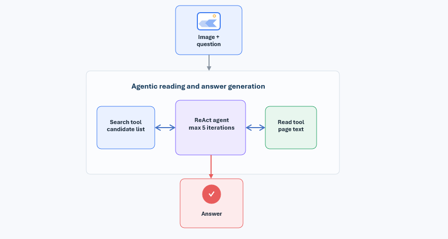
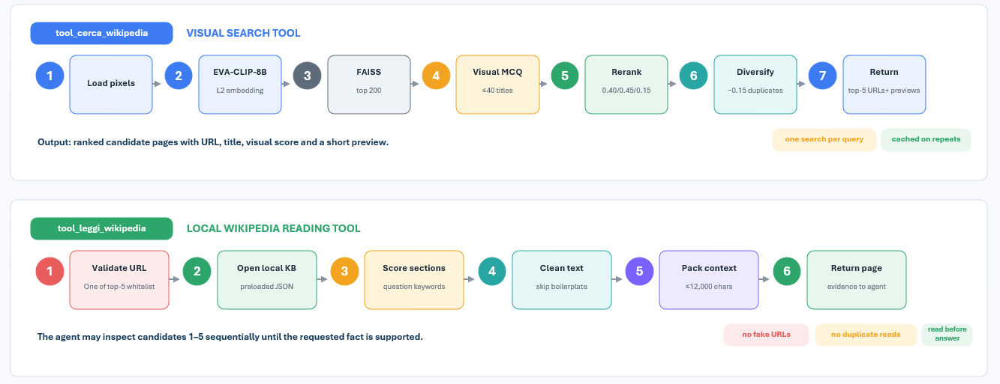

# VIMO: Encyclopedic Visual Question Answering with Multimodal Agentic RAG


This repository contains the full implementation and evaluation code for a comparative study of four pipelines for **Encyclopedic Visual Question Answering (EVQA)**: a plain Vision-Language Model (VLM), a non-agentic Retrieval-Augmented Generation system (RAG), and two Agentic RAG (ARAG) systems built around a ReAct agent, differing only in their generator/controller backbone (Qwen2.5-VL-3B-Instruct vs Qwen3-VL-8B-Instruct).

All retrieval-based systems share the same visual retrieval backbone: **EVA-CLIP-8B** embeddings indexed with **FAISS** over ~55,000 Wikipedia images, linked to a local Wikipedia knowledge base (title, sections, and images per article).


---



## 1. Project Overview

Answering questions about an image often requires more than visual recognition. A model may correctly describe *what* is in the picture, yet fail to answer *where a plant is native to* or *who designed a building*, because that fact is not encoded in the pixels or in the model's parametric knowledge. This project studies how much of that gap can be closed by:

1. adding **external visual retrieval** (RAG), and
2. adding an **agentic reading loop** that lets the model decide which retrieved page to inspect, when to keep reading, and when it has enough evidence to answer.

Four systems are compared on the same 1,000-question EVQA test set:

| # | System | Backbone | Retrieval | Agent |
|---|--------|----------|-----------|-------|
| 1 | **VLM** | Qwen2.5-VL-3B-Instruct | ✗ | ✗ |
| 2 | **RAG** | Qwen2.5-VL-3B-Instruct | One-shot (top-5 visual retrieval) | ✗ |
| 3 | **ARAG v16** | Qwen2.5-VL-3B-Instruct | Iterative | ReAct |
| 4 | **ARAG v21** | Qwen3-VL-8B-Instruct | Iterative (same retriever) | ReAct |

Experiments 1–3 share the same backbone, so their difference isolates the effect of retrieval and of agentic control. Experiment 4 keeps the agentic architecture fixed and swaps the backbone, isolating the effect of a stronger generator/controller.

---

## 2. Architecture
### 2.1 Shared Visual Retrieval Backbone

Every retrieval-based system (RAG, ARAG v16, ARAG v21) uses the same pipeline to go from an image to a shortlist of candidate Wikipedia pages:

1. **Visual encoding** — the query image is encoded with EVA-CLIP-8B and L2-normalized:

   ```
   z_I = f_EVA-CLIP-8B(I) / ‖f_EVA-CLIP-8B(I)‖₂
   ```

2. **FAISS search** — the embedding is searched against a FAISS index (inner-product search over normalized vectors, equivalent to cosine similarity) built from ~55,000 Wikipedia-linked images. A broad candidate pool is retrieved (200 for entity disambiguation, up to 250 for final reranking).

3. **Visual multiple-choice disambiguation (MCQ)** — up to 40 unique candidate titles from the pool are shown to the VLM as a menu. Given the image (and the question, when available), the model produces a short caption and picks the single most likely title (`PICKED_TITLE`), or `NONE`.

4. **Composite reranking** — each of the up to 250 candidates is scored with a weighted composite (all "S" terms of the original scoring formula are denoted here with the Greek capital letter **Σ**, its natural analogue):

   ```
   Σ(c) = 0.40 · Σ_vis(c) + 0.45 · Σ_mcq(c) + 0.15 · Σ_kw(c)
   ```

   - **Σ_vis(c)** — visual similarity score, normalized from the FAISS rank of candidate `c`.
   - **Σ_mcq(c)** — set to 1.20 if `c`'s title matches the VLM-picked title, 0 otherwise.
   - **Σ_kw(c)** — lexical overlap between the question's informative terms and the candidate's title/URL.

   A lexical diversity penalty of 0.15 is then subtracted for each additional candidate sharing the same title group, to reduce near-duplicate results. The five highest-scoring pages, with short text previews, are exposed to the downstream generator or agent.

This retrieval backbone is implemented in `Qwen_retrieval.py` / `Qwen_retrieval_3.py` and in the `tool_cerca_wikipedia` tool of the two agentic tool files.

### 2.2 VLM Baseline (`baseline/vlm/`)

Receives only the image and the question and generates an answer directly with Qwen2.5-VL-3B-Instruct, using deterministic (greedy) decoding. No retrieval, no verification against external knowledge — a pure parametric-knowledge baseline.

### 2.3 Non-Agentic RAG (`baseline/rag/`)

Uses the shared retriever to obtain the top-5 Wikipedia pages, concatenates their full text (with a per-document truncation safeguard against GPU memory limits), and generates a single answer conditioned on the image, the question, and the concatenated context. It cannot discard a wrong page or request another one — everything is decided in a single forward pass.

### 2.4 Agentic RAG (`agentic_rag/v16/` and `agentic_rag/v21/`)

The agent wraps the VLM in a LangChain **ReAct** agent with two tools:

- **`tool_cerca_wikipedia`** — runs the shared visual retrieval pipeline and returns the top-5 ranked candidates with previews. Can only be called once per query (subsequent calls return the cached list).
- **`tool_leggi_wikipedia`** — takes one exact candidate URL plus the current question, retrieves the article from the local knowledge base, reranks its sections by keyword relevance to the question, and returns up to a 12,000-character budget of the most relevant sections.

The agent follows a strict **search-before-read** policy, may inspect any of the five candidate URLs, and is capped at five ReAct iterations. It is supported by deterministic guardrails rather than relying on prompt compliance alone:

- **Search-before-read** — the reading tool is disabled until a valid candidate list exists.
- **URL whitelist** — only URLs returned by the current search observation may be read; hallucinated URLs are rejected.
- **Single-search rule** — repeated search calls are redirected to the cached candidate list.
- **Duplicate-read redirection** — re-reading an already visited URL is automatically redirected to the next unread candidate.
- **Input validation** — malformed inputs and image paths passed to the reading tool are normalized or rejected.
- **Grounding and termination** — a final answer is blocked until at least one page has been read; if the 5-step limit is hit, a **fallback generator** answers using only the Wikipedia text actually read during the episode.

Thread-local state (`tools_real_*.py`) tracks the current question, candidate URLs, visited URLs, and retrieved observations per query, so parallel evaluation runs do not interfere with each other.

#### v16 vs v21

Both versions share the same retriever, FAISS index, MCQ menu, and two-tool ReAct loop. They differ only in the generator/controller and in a few implementation refinements:

| Component | v16 | v21 |
|---|---|---|
| Backbone | Qwen2.5-VL-3B-Instruct | Qwen3-VL-8B-Instruct |
| Retriever | EVA-CLIP-8B / FAISS | same |
| Guardrails | prompt + tool state | wrapper + prompt + tool state |
| Fallback generation | 128 tokens | 30 tokens |
| MCQ menu size | 40 titles | same |
| Final candidate pages | top 5 | top 5 |

---

## 3. Evaluation Setup

All four systems are evaluated on the **same 1,000-question test set** drawn from the Encyclopedic-VQA benchmark, split into three question categories:

- **585** automatic (single-fact) questions
- **205** multi-answer questions (require listing all applicable items)
- **210** templated questions

All questions in this quantitative evaluation are **single-hop**: the answer is obtained by identifying the depicted entity and retrieving one target fact. This pairing keeps data composition identical across all four systems, so score differences are attributable to the pipeline design alone.

Each pipeline exposes a `run_*` entry point (`run_vlm_only`, `run_standard_rag`, `run_agentic_rag`) that returns a structured record (question id, prediction, ground truth, retrieved URLs, tool calls, latency, error status, etc.), consumed by the corresponding evaluation script for scoring.

---

## 4. Results

### 4.1 Overall Comparison

| System | Backbone | Retrieval | Agent | Overall | Automatic | Multi-answer | Templated |
|---|---|---|---|---|---|---|---|
| VLM | Qwen2.5-VL-3B | No | No | 0.234 | 0.328 | 0.049 | 0.152 |
| RAG | Qwen2.5-VL-3B | One-shot | No | 0.283 | 0.340 | 0.156 | 0.248 |
| ARAG v16 | Qwen2.5-VL-3B | Iterative | Yes | 0.347 | 0.436 | 0.190 | 0.252 |
| **ARAG v21** | **Qwen3-VL-8B** | **Iterative** | **Yes** | **0.370** | **0.439** | **0.229** | **0.314** |

Retrieval alone (RAG vs VLM) improves the overall score by **4.9 points**; adding the agentic loop (ARAG v16 vs RAG) adds a further **6.4 points**; replacing the backbone (v21 vs v16) adds another **2.3 points**, concentrated mostly in multi-answer and templated questions.

### 4.2 Detailed ARAG Comparison (v16 vs v21)

| Metric | v16 | v21 | Relative Δ |
|---|---|---|---|
| EVQA overall | 0.347 | 0.370 | +6.6% |
| Automatic | 0.436 | 0.439 | +0.8% |
| Multi-answer | 0.190 | 0.229 | +20.5% |
| Templated | 0.252 | 0.314 | +24.6% |
| Exact match | 0.047 | 0.035 | −25.5% |
| Contains match | 0.224 | 0.229 | +2.2% |
| Semantic score | 0.229 | 0.252 | +10.0% |
| Hallucination proxy | 76.9% | 74.7% | −2.2 pp |

Per-question agreement between the two agentic versions (1,000 questions): both correct on 141, only v16 correct on 90, only v21 correct on 111, neither on 658 — a net gain of 21 questions, showing the backbone swap does not uniformly improve every prediction.

### 4.3 Operational Efficiency

| Metric | v16 | v21 |
|---|---|---|
| Mean latency | 29.7 s | 49.9 s |
| Median latency | 17.9 s | 28.0 s |
| 90th percentile latency | 74.8 s | 143.7 s |
| Mean agent steps | 2.83 | 2.61 |
| Mean pages read | 1.61 | 1.52 |
| Resolved in 2 steps | 663 | 713 |
| Hit 5-step limit | 241 | 177 |
| Zero pages read | 13 | 36 |
| Mean answer length (words) | 15.9 | 11.9 |

v21 makes better per-step decisions (fewer steps, fewer 5-step-limit hits) but each model call is markedly more expensive, resulting in ~1.7× higher mean latency.

---

## 5. Conclusion

Three findings emerge from this comparison:

1. **External knowledge is necessary.** Standard RAG improves the plain VLM by 20.9% relative overall and more than triples multi-answer accuracy — parametric knowledge alone is not sufficient for fine-grained entities, dates, and lists.
2. **Retrieval alone is not enough.** The largest single gain in this study comes from making the system agentic: sequential, verifiable page reading reduces context noise, allows recovery from an initially wrong candidate, and avoids some of the memory failures caused by naive full-page concatenation.
3. **Backbone strength mainly helps structured extraction.** Qwen3-VL-8B barely moves automatic-question accuracy but substantially improves multi-answer and templated performance, at the cost of a ~68% increase in mean latency.

In practice, **ARAG v21 (Qwen3-VL-8B)** is the preferred configuration when answer quality is the primary objective, especially for multi-answer and templated questions. **ARAG v16 (Qwen2.5-VL-3B)** remains preferable for latency-constrained or high-throughput batch processing, since it preserves nearly the same automatic-question accuracy at substantially lower cost. Retrieval quality and wrong-entity disambiguation remain the main bottleneck for both agentic versions, as reflected by a still-high hallucination proxy.

---

## 6. Repository Structure

```
.
├── baseline/
│   ├── vlm/
│   │   ├── baseline_vlm.py          # Plain VLM pipeline (no retrieval)
│   │   ├── Qwen_retrieval.py        # generate_answer() helper (shared)
│   │   └── evaluate_vlm.py          # Evaluation script for the VLM baseline
│   │
│   └── rag/
│       ├── baseline_rag.py          # Non-agentic RAG pipeline (top-5 one-shot)
│       ├── tools_real.py            # Retrieval motors (CLIP + FAISS + Wikipedia KB)
│       ├── Qwen_retrieval.py        # Feature extraction + generation helpers
│       └── evaluate_rag.py          # Evaluation script for the RAG baseline
│
└── agentic_rag/
    ├── v16/                        # Qwen2.5-VL-3B-Instruct agentic pipeline
    │   ├── agent_real_2_16.py       # ReAct agent, prompt, guardrails, fallback
    │   ├── tools_real_2_16.py       # Search / read tools, MCQ reranking, state
    │   ├── Qwen_retrieval.py        # Feature extraction + generation helpers
    │   └── evaluate_agentic_v16.py  # Evaluation script for ARAG v16
    │
    └── v21/                        # Qwen3-VL-8B-Instruct agentic pipeline
        ├── agent_real_21.py         # ReAct agent (with parser monkey-patch), guardrails
        ├── tools_real_21.py         # Search / read tools, MCQ reranking, state
        ├── Qwen_retrieval_3.py      # Feature extraction + generation helpers (Qwen3)
        └── evaluate_agentic_v21.py  # Evaluation script for ARAG v21
```

Each of the three top-level components (`vlm`, `rag`, and each of `v16`/`v21` inside `agentic_rag`) contains its own evaluation script, which loads the shared 1,000-question EVQA test set, calls the corresponding `run_*` function per example, and writes a JSON of aggregate scores plus a JSONL of per-question records (predictions, retrieved/read URLs, tool calls, latency).

---

## 7. Running the Project Locally

### 7.1 Requirements

- Linux with an NVIDIA GPU (tested configuration: ≥48 GB VRAM for the RAG/ARAG pipelines due to long concatenated contexts; the plain VLM baseline fits in less)
- Python 3.10+
- CUDA toolkit matching your installed PyTorch build

### 7.2 Environment Setup

```bash
# Create and activate a virtual environment
python3 -m venv evqa-env
source evqa-env/bin/activate

# Core dependencies
pip install torch --index-url https://download.pytorch.org/whl/cu121   # match your CUDA version
pip install transformers accelerate
pip install faiss-gpu                 # or faiss-cpu if no GPU indexing is needed
pip install qwen-vl-utils
pip install langchain langchain-core langchain-classic   # ReAct agent + prompt utilities
pip install pillow requests numpy
```

> The two agentic pipelines depend on `langchain.agents.create_react_agent` / `AgentExecutor`, imported with a fallback to `langchain_classic` for newer LangChain releases — install whichever major version is available in your environment.

### 7.3 Model Assets

Download the following checkpoints locally (all pipelines load models with `local_files_only=True`, so no runtime internet access to model hubs is required):

| Model | Used by | Notes |
|---|---|---|
| **Qwen2.5-VL-3B-Instruct** | VLM baseline, RAG baseline, ARAG v16 | generator + ReAct controller |
| **Qwen3-VL-8B-Instruct** | ARAG v21 | generator + ReAct controller |
| **EVA-CLIP-8B** | RAG baseline, ARAG v16, ARAG v21 | visual encoder for retrieval |
| **CLIP-ViT-L/14** image processor | all retrieval pipelines | image preprocessing companion to EVA-CLIP |

Place them under a local `models/` directory, e.g.:

```
models/
├── qwen2.5-vl-3b-instruct/
├── qwen3-vl-8b-instruct/
├── eva-clip-8b/
└── clip-vit-large-patch14/
```

### 7.4 Knowledge Base and FAISS Index

You will need:

1. A **FAISS index** (`.index` file) built over EVA-CLIP-8B embeddings of ~55,000 Wikipedia-linked images.
2. An **index map** (JSON) mapping each FAISS position to `[article_url, title, local_path]`.
3. A **local Wikipedia knowledge base** (JSON) keyed by article URL, containing `title`, `section_titles`, `section_texts`, `image_urls`, and `image_section_indices` per article.

These three assets come from the Encyclopedic-VQA benchmark's precomputed image-embedding resources; place them wherever convenient and reference their paths in your configuration (see below).

### 7.5 Configuration

All entry-point scripts call `load_config()` to populate a shared `Args` object with, at minimum:

```python
model_path        # path to the Qwen VLM checkpoint (2.5-VL-3B or 3-VL-8B)
retriever_path    # path to the EVA-CLIP-8B checkpoint
index_path        # path to the FAISS .index file
index_json_path   # path to the index-map JSON
kb_wikipedia_path # path to the local Wikipedia knowledge-base JSON
```

Create a `load_config.py` in your working directory returning a dictionary (or config object) with these keys pointing at your local `models/` and data directories.

### 7.6 Running a Pipeline

Each baseline can be run standalone for a quick smoke test:

```bash
# Plain VLM
python baseline/vlm/baseline_vlm.py

# Non-agentic RAG (starts the retrieval + generation "motors" first)
python baseline/rag/baseline_rag.py
```

The agentic pipelines expose `run_agentic_rag(image_path, question, ...)`, used by their respective evaluation scripts:

```bash
# ARAG v16 — Qwen2.5-VL-3B-Instruct
python agentic_rag/v16/evaluate_agentic_v16.py

# ARAG v21 — Qwen3-VL-8B-Instruct
python agentic_rag/v21/evaluate_agentic_v21.py
```

Each evaluation script will:
1. Load the 1,000-question EVQA test set (image path, question, ground truth, expected sources, question type).
2. Call the pipeline's `run_*` function per example, collecting per-question records.
3. Compute aggregate metrics (official EVQA score, exact/contains match, semantic similarity, hallucination proxy, latency) and write them to a `evqa_scores_*.json` summary plus a `records_*.jsonl` file with one record per question.

### 7.7 Notes on Reproducibility

- All generation is run with **greedy decoding** (`do_sample=False`) for determinism.
- A fixed random seed (`set_seed(42)`) is applied to the retrieval/model loading utilities.
- Thread-local state in the agentic tool modules ensures that parallel or repeated evaluation runs do not leak state between questions.
        